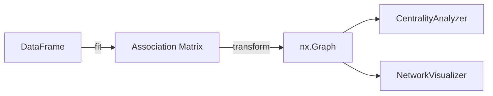

# Correlation Network


Python library that builds association networks from pandas DataFrames. Computes pairwise association measures (correlations, Cramer's V, mutual information, etc.), applies threshold filtering, and produces NetworkX graphs with centrality analysis and visualization.

## Features

- **Association methods**: Pearson, Spearman, Kendall, Cramer's V, Correlation Ratio, Mutual Information, PhiK
- **Auto-detection**: selects the right measure based on column types (numeric, categorical, mixed)
- **API**: scikit-learn-style `fit()` / `transform()` / `fit_transform()` pipeline
- **Centrality**: degree, strength, betweenness, eigenvector, closeness — individual or summary table
- **Visualization**: continuous colormap, community detection coloring, centrality-scaled nodes, per-edge alpha
- **Extensible**: any object implementing the `AssociationStrategy` protocol can be plugged in

## Project Structure

```
correlation-network/
├── src/correlation_network/
│   ├── __init__.py              # Public API exports
│   ├── network.py               # CorrelationNetwork (main entry point)
│   ├── centrality.py            # CentralityAnalyzer (5 metrics + summary)
│   ├── visualization.py         # NetworkVisualizer (5 layouts, colormap, community colors)
│   ├── exceptions.py            # NotFittedError, InsufficientColumnsError, NoCompleteObservationsError
│   ├── py.typed                 # PEP 561 marker: ships inline type information
│   ├── _types.py                # Literal type aliases (AssociationMethod, CentralityMetric, LayoutAlgorithm, CorrelationMethod)
│   ├── _validation.py           # check_is_fitted guard
│   ├── _graph_utils.py          # Shared graph utilities (abs_weight_graph, distance_graph)
│   └── association/
│       ├── __init__.py           # Re-exports all strategies
│       ├── _base.py              # AssociationStrategy (Protocol)
│       ├── _correlation.py       # Pearson, Spearman, Kendall
│       ├── _categorical.py       # Cramer's V, Correlation Ratio (eta)
│       ├── _universal.py         # PhiK, Mutual Information
│       └── _auto.py              # Auto-detection + dispatch
├── tests/
│   ├── conftest.py               # Shared fixtures (numeric, categorical, mixed DataFrames)
│   ├── unit/                     # One test file per module
│   └── integration/              # End-to-end pipeline tests
├── .github/workflows/ci.yml      # Lint, format, and test matrix (Python 3.10–3.13)
├── pyproject.toml                # Metadata, dependencies, ruff and pytest config
├── uv.lock                       # Locked dependency versions
├── CHANGELOG.md                  # Keep a Changelog format
└── LICENSE                       # MIT
```

## Dependencies

| Package | Description | Link |
|---------|-------------|------|
| [NetworkX](https://networkx.org/) | Graph data structures, algorithms, and layout | [Docs](https://networkx.org/documentation/stable/) |
| [pandas](https://pandas.pydata.org/) | DataFrame input and association matrix storage | [Docs](https://pandas.pydata.org/docs/) |
| [NumPy](https://numpy.org/) | Array operations for matrix computation | [Docs](https://numpy.org/doc/stable/) |
| [SciPy](https://scipy.org/) | Chi-squared test (Cramer's V), entropy (Mutual Information) | [Docs](https://docs.scipy.org/doc/scipy/) |
| [Matplotlib](https://matplotlib.org/) | Graph rendering, colormaps, and figure export | [Docs](https://matplotlib.org/stable/contents.html) |

Optional extras:

| Extra | Description | Link |
|-------|-------------|------|
| `phik` | PhiK correlation (works on any column type pair) | [Docs](https://phik.readthedocs.io/) |
| `polars` | Accept Polars DataFrames as input (auto-converted to pandas) | [Docs](https://docs.pola.rs/) |

## Installation

Requires Python >= 3.10 and [uv](https://docs.astral.sh/uv/).

```bash
git clone https://github.com/skateddu/correlation-network.git
cd correlation-network
uv sync
```

With optional extras:

```bash
uv sync --extra phik       # PhiK correlation support
uv sync --extra polars     # Polars DataFrame support
uv sync --all-extras       # All optional dependencies
```

## Architecture

The library follows a pipeline pattern: DataFrame in, graph out.



| Concept | Implementation | Module |
|---------|---------------|--------|
| Pluggable metrics | `AssociationStrategy` Protocol | `association/_base.py` |
| Metric dispatch | `_STRATEGY_REGISTRY` dict | `network.py` |
| Fit/transform pipeline | scikit-learn-style API | `network.py` |
| Graph centrality | NetworkX algorithms wrapper | `centrality.py` |
| Negative weight handling | `abs_weight_graph()` helper | `_graph_utils.py` |
| Association → distance | `distance_graph()` helper | `_graph_utils.py` |
| Fitted state guard | `check_is_fitted()` function | `_validation.py` |
| Rendering | Matplotlib + NetworkX drawing | `visualization.py` |

## Quick Start

### Python API

```python
import pandas as pd
from correlation_network import CorrelationNetwork, CentralityAnalyzer, NetworkVisualizer

# Build the network (default: method="pearson", threshold=0.5)
net = CorrelationNetwork(method="spearman", threshold=0.3)
graph = net.fit_transform(df)

# Analyze centrality
analyzer = CentralityAnalyzer(graph)
rankings = analyzer.summary()
print(rankings)

# Visualize
viz = NetworkVisualizer(graph)
fig = viz.plot(
    centrality_metric="degree",
    community_colors=True,
    title="Association Network",
)
```

### Save directly

```python
viz.save("network.png", dpi=150, community_colors=True, title="My Network")
```

### From a pre-computed matrix

```python
# Use a correlation matrix you already have
net = CorrelationNetwork.from_matrix(my_matrix, threshold=0.5)
graph = net.transform()
```

### With Polars DataFrames

```python
import polars as pl

df_polars = pl.read_csv("data.csv")
graph = CorrelationNetwork(method="pearson", threshold=0.5).fit_transform(df_polars)
```

## Constructor Parameters

| Parameter | Default | Description |
|-----------|---------|-------------|
| `method` | `"pearson"` | Association method (see table below) |
| `threshold` | `0.5` | Minimum `\|weight\|` to keep an edge (inclusive) |
| `strategy` | `None` | Custom `AssociationStrategy` instance (overrides `method`) |
| `cardinality_threshold` | `0.95` | Exclude columns with `nunique/nrows >= threshold` |

## Preprocessing

Before computing associations, `fit()` automatically excludes:

- **Datetime columns** (not suitable for correlation)
- **High-cardinality columns** where `nunique / nrows >= cardinality_threshold` (e.g. IDs, UUIDs)

Excluded columns are stored in `net.excluded_columns_` after fitting:

```python
net = CorrelationNetwork(method="auto", threshold=0.3)
net.fit(df)
print(net.excluded_columns_)  # ['timestamp', 'row_id']
```

## Association Methods

| Method | Strategy Class | Column Types | Output Range |
|--------|---------------|-------------|--------------|
| `pearson` | `PearsonStrategy` | numeric — numeric | [-1, 1] |
| `spearman` | `SpearmanStrategy` | numeric — numeric | [-1, 1] |
| `kendall` | `KendallStrategy` | numeric — numeric | [-1, 1] |
| `cramers_v` | `CramersVStrategy` | categorical — categorical | [0, 1] |
| `correlation_ratio` | `CorrelationRatioStrategy` | categorical — numeric | [0, 1] |
| `mutual_information` | `MutualInformationStrategy` | any | [0, 1] |
| `phik` | `PhiKStrategy` | any | [0, 1] |
| `auto` | `AutoAssociationStrategy` | auto-detects types | [0, 1] |

Each method requires columns of the type it operates on. Passing a DataFrame
that cannot satisfy it raises `InsufficientColumnsError` rather than silently
returning an empty matrix:

```python
from correlation_network import InsufficientColumnsError

try:
    CorrelationNetwork(method="cramers_v").fit(numeric_only_df)
except InsufficientColumnsError as err:
    print(err.method, err.required, err.found)
    # cramers_v  at least 2 categorical columns  []
```

### Missing values

Every method evaluates a column pair on the rows where **both** values are
present (pairwise-complete observations), the same convention `pandas.corr()`
uses. Rows missing elsewhere in the DataFrame do not affect an unrelated pair.

If a pair shares no complete rows at all, its association is undefined and
`NoCompleteObservationsError` is raised rather than a misleading zero:

```python
from correlation_network import NoCompleteObservationsError

try:
    CorrelationNetwork(method="auto").fit(df)
except NoCompleteObservationsError as err:
    print(err.columns)  # ('cat', 'v')
```

> **Mutual information and bin count.** `MutualInformationStrategy` discretizes
> numeric columns into `n_bins` (default 10) before computing MI. With few
> samples per bin the estimate is biased upward: on 200 rows, two *independent*
> columns score ≈0.10 at `n_bins=10` but ≈0.50 at `n_bins=50`. Raise `n_bins`
> only when you have the rows to support it, and set `threshold` accordingly.

### Auto mode

When `method="auto"`, the library detects column dtypes and dispatches:

| Pair type | Default strategy |
|-----------|-----------------|
| numeric — numeric | Spearman |
| categorical — categorical | Cramer's V |
| mixed | Correlation Ratio |

```python
net = CorrelationNetwork(method="auto", threshold=0.3)
graph = net.fit_transform(df)
```

> **Auto mode discards the sign.** Numeric correlations are reduced to their
> absolute value so all three measures share a [0, 1] scale (Cramer's V and eta
> are non-negative by definition). A Spearman of `-0.98` becomes `0.98`, and the
> positive/negative edge colouring in `NetworkVisualizer` has no effect on such a
> graph. Use an explicit correlation method when the direction matters.

### Custom strategies

Any object implementing the `AssociationStrategy` protocol (`compute(df) -> pd.DataFrame`) can be used:

```python
net = CorrelationNetwork(strategy=my_custom_strategy, threshold=0.3)
```

## Centrality Analysis

| Method | Description |
|--------|-------------|
| `degree()` | Normalized degree: connected neighbors as fraction of (n-1) |
| `strength()` | Sum of absolute edge weights |
| `betweenness()` | Frequency on shortest paths (weights converted to distances) |
| `eigenvector()` | Influence based on connections to high-scoring nodes |
| `closeness()` | Inverse average distance to all other nodes (weights converted to distances) |
| `summary()` | DataFrame with all metrics combined |

```python
analyzer = CentralityAnalyzer(graph)

analyzer.degree()       # pd.Series, sorted descending
analyzer.summary()      # pd.DataFrame with all 5 metrics
```

### Association strength vs. graph distance

`betweenness()` and `closeness()` are path-based, and NetworkX reads the edge
attribute it is given as a **cost**. Association values run the other way — a
weight near 1 means two nodes are *close*, not far apart. Both metrics therefore
convert weights with `distance = 1 - |weight|` before running Dijkstra, so
shortest paths follow strongly associated pairs.

`strength()` is a magnitude sum rather than a path metric, so it keeps using the
raw absolute weights.

## Visualization

| Parameter | Default | Description |
|-----------|---------|-------------|
| `layout` | `kamada_kawai` | Layout algorithm (`spring`, `circular`, `shell`, `spectral`) |
| `centrality_metric` | `None` | Scale node size by centrality (`degree`, `strength`, etc.) |
| `figsize` | `(10, 8)` | Figure size in inches |
| `dpi` | `100` | Figure resolution |
| `node_color` | `tab:blue` | Node color (ignored when `community_colors=True`) |
| `community_colors` | `False` | Color nodes by greedy modularity community |
| `edge_cmap` | `RdYlGn` | Continuous colormap for edges (`None` for two-color mode) |
| `positive_edge_color` | `darkgreen` | Positive edge color (two-color mode only) |
| `negative_edge_color` | `tab:red` | Negative edge color (two-color mode only) |
| `font_size` | `10` | Font size for node labels |
| `edge_label_font_size` | `8` | Font size for edge weight labels |
| `show_edge_labels` | `True` | Display edge weight labels |
| `title` | `None` | Plot title |

```python
viz = NetworkVisualizer(graph)

fig = viz.plot(
    layout="kamada_kawai",
    centrality_metric="degree",
    community_colors=True,
    edge_cmap="RdYlGn",
    title="My Network",
)

viz.save("network.png", dpi=150, community_colors=True)
```

## Testing

```bash
# Run all tests
uv run pytest

# Run a specific test file
uv run pytest tests/unit/test_network.py -v

# Run tests matching a pattern
uv run pytest -k "centrality" -v

# Run with coverage
uv run pytest --cov=src/correlation_network

# Lint and format
uv run ruff check src/ tests/
uv run ruff format src/ tests/
```

## References

- Newman, M. E. J. (2010). *Networks: An Introduction*. Oxford University Press.
- Cramér, H. (1946). *Mathematical Methods of Statistics*. Princeton University Press.
- Bergsma, W. (2018). [A new correlation coefficient](https://arxiv.org/abs/1712.05289). *arXiv:1712.05289* — PhiK foundation.
- Reshef, D. et al. (2011). [Detecting Novel Associations in Large Data Sets](https://doi.org/10.1126/science.1205438). *Science*.
